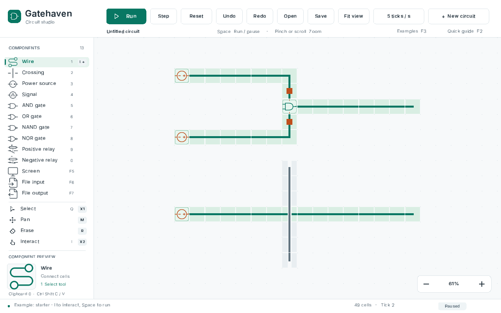

# Gatehaven

**Build circuits. Bring logic to life.**

[](https://github.com/michaelbawuah/Gatehaven/actions/workflows/ci.yml)

Gatehaven is a digital logic sandbox built in C++23. Connect wires, combine
logic gates, and step through a circuit to see how its signals change.

[Download Gatehaven Preview 1](https://github.com/michaelbawuah/Gatehaven/releases/tag/v0.5.0-preview.1) ·
[Watch the 50-second gameplay demo (MP4)](https://github.com/michaelbawuah/Gatehaven/releases/download/v0.5.0-preview.1/Gatehaven-Gameplay-Demo.mp4)



[View all 13 components](docs/images/component-gallery.png) · [Gate symbols up close](docs/images/circuit-symbols.png).

**Status: 0.5 unsigned development preview.** Downloads are available for
Windows, macOS, and Linux. Mac builds are not notarized; hands-on accessibility
and clean-machine acceptance remain in progress. See
[verification notes](docs/verification.md) for exactly what has been tested.

[Current preview and release status](docs/preview-0.5.0.md) lists the
verified candidate, downloads for each platform, and remaining release work.

The editor now includes chained polylines, connected and sparse selections,
interactive screens, binary file communicators, persistent tool preferences,
native pinch navigation, crash recovery, keyboard access to every control,
offline manuals, save-conflict protection, and six built-in circuit lessons.
Legacy `.ccsb` import/export preserves saved/reset levels. A compiled electrical
component engine, keyboard canvas, and native text inspector make large circuits
easier to explore. Linux previews include AppImages. Large clipboard and stroke
previews use clipped queries. The
[published preview](https://github.com/michaelbawuah/Gatehaven/releases/tag/v0.5.0-preview.1)
contains verified [native packages](docs/packaging.md) from the candidate's CI run.

## Try the core

A C++23 compiler and CMake 3.28 or later are required. The simulation core has no
external dependencies. Generated offline guides and tests require Python 3.
The initial local build uses GCC 13.3.0 and CMake 4.4.4.

```sh
git clone https://github.com/michaelbawuah/Gatehaven.git
cd Gatehaven
cmake -S . -B build/core -DCMAKE_BUILD_TYPE=Debug
cmake --build build/core --config Debug
ctest --test-dir build/core -C Debug --output-on-failure
```

On Linux and macOS:

```sh
./build/core/gatehaven-cli check samples/starter.ghv
./build/core/gatehaven-cli run samples/oscillator.ghv 10
./build/core/gatehaven-cli stats samples/starter.ghv
./build/core/gatehaven-cli trace samples/oscillator.ghv 8
./build/core/gatehaven-cli svg samples/gate-gallery.ghv gallery.svg
```

With Visual Studio's multi-configuration generator, executables are under
`build/core/Debug/` and have an `.exe` suffix.

## Play the desktop prototype

The application uses SDL **3.4.18**, pinned in `vcpkg.json`. Set up vcpkg as
described in [the build guide](docs/building.md), then run:

```sh
cmake --preset desktop
cmake --build --preset desktop
ctest --preset desktop
```

Launch `build/desktop/gatehaven` on Linux, `build/desktop/Debug/gatehaven.exe`
with Visual Studio, or `build/desktop/gatehaven.app` on macOS. Generator-specific
configuration subdirectories may apply. The starter circuit opens automatically.

| Action | Input |
| --- | --- |
| Choose a component | Sidebar or digits 1 through 0 |
| Bind a tool | Click its sidebar name with the button to bind |
| Draw / erase (default bindings) | Left / right mouse drag |
| Chain snapped lines | Shift+click; Backspace retraces; Enter or double-click finishes |
| Pan / zoom (default bindings) | Middle mouse drag / scroll wheel or trackpad pinch |
| Zoom in / out (12.5%–800%) | Lower-right + / − buttons, or + / − keys; Ctrl/Command also works |
| Reset zoom to 100% | Click the zoom percentage or Ctrl/Command+0 |
| Sample a component tool | Hold E and click with the button to bind |
| Play or pause / single step | Space / Right arrow when no selection is active |
| Set simulation speed | Speed button or Cmd+Shift+T on Mac / Ctrl+Shift+T on Windows/Linux; 1–1,000 ticks/s |
| Reset / frame circuit | R / F |
| Select a region | Q, then drag |
| Add / subtract selection | Shift / Alt while selecting |
| Select an electrical net / physical circuit | Double / triple-click with Select |
| Move a selection | Arrow keys; hold Cmd on Mac / Ctrl on Windows/Linux to move four cells |
| Duplicate / invert selection | Ctrl+D / Ctrl+I |
| Copy / cut / paste | Ctrl+C / Ctrl+X / Ctrl+V |
| Copy / cut / paste with a chosen shared clipboard | Ctrl+Shift+C / Ctrl+Shift+X / Ctrl+Shift+V, then 0–9 |
| Undo / redo | Ctrl+Z / Ctrl+Y |
| Rotate / flip selection or clipboard | [ and ] / H and V |
| Save / Save As / Open / New | Ctrl+S / Ctrl+Shift+S / Ctrl+O / Ctrl+N |
| Screen / File In / File Out | F5 / F6 / F7 |
| Interact with a communicator | I, then hold a screen or click a file port |
| Manual / shortcuts / circuit lessons / recovery | F1 / F2 / F3 / F4 |
| Navigate controls / activate | Tab or Shift+Tab / Enter |
| Keyboard canvas / use tool | F9, arrows / Enter |
| Inspect cell or focused control / single step in cursor mode | F8 / F10 |
| High contrast | Contrast button or Cmd+Shift+K on Mac / Ctrl+Shift+K on Windows/Linux; F11 if available |
| Window summary | F12 |
| Touchscreen pan and zoom | Two fingers on the canvas |
| Toggle beginner hints | B |

On macOS, use Command for the Ctrl shortcuts above. On Mac laptops, hold Fn for
F1–F12 or enable standard function keys in Keyboard settings. macOS may reserve
F11 for Show Desktop; the Contrast button and Cmd+Shift+K avoid that conflict.
Undo records one drawing stroke as one edit.
Gate, relay, and communicator pencils place a Signal when clicked on an existing cell of the
same type. Native documents use `.ghv`; binary `.ccsb` interchange is supported.
Legacy export translates the occupied rectangle to `(0,0)`; native saves keep
signed coordinates. See [format limits](docs/document-format.md).

New and Open launch separate Gatehaven instances and preserve the current
document. All running instances share ten session clipboards. Ordinary copy,
cut, and paste use slot 0, which follows the last clipboard used. The clipboard
chooser selects a particular slot; an active paste preview stays unchanged if
another window updates it. Closing the last instance clears clipboard contents.
After an abrupt shutdown of every instance, the next launch clears abandoned data.

The binding markers identify left (red), right (blue), middle (green), X1 (cyan),
X2 (magenta), and touch (yellow). Bindings, speed, high contrast, and beginner hints are saved
when the window closes; the last window to save determines the next launch's
preferences. One finger uses its binding; two fingers pan and pinch the canvas.
Recovery snapshots protect unsaved work separately from session clipboards; F4
restores abandoned circuits as unsaved documents. See the manual for timing and limits.

Adjacent communicators of the same type operate as a group. Screen brightness
shows the circuit's outgoing signal; holding it with Interact drives its incoming
signal. File ports require an explicit file choice in that window and use the
[serial protocol](docs/communicators.md). File paths never travel with a circuit
or clipboard. Press F3 for editable [lessons](samples/README.md).

## Under the hood

- A sparse circuit grid indexes occupied rows and columns for viewport queries.
- Compiled electrical components and reusable buffers reduce simulation work;
  dormant circuits skip propagation until edited or a live endpoint is attached.
- Two-phase simulation reads gate inputs from the previous tick before
  propagating power. Crossing wires keep horizontal and vertical channels separate.
- The simulation library is independent of SDL and runs headlessly in tests.
- Documents are validated before loading. Saves replace the destination only
  after a temporary file has been written and closed successfully.
- Desktop controls have an automated smoke test using SDL's event queue.
- Shared clipboard tests run separate processes, exchange data concurrently,
  terminate peers, and verify session cleanup and recovery.

[Architecture](docs/architecture.md) · [Roadmap](docs/roadmap.md) ·
[Document format](docs/document-format.md) · [Shared clipboards](docs/shared-clipboards.md) ·
[Manual](docs/manual.md) · [CLI tools](docs/cli.md) · [State digests](docs/state-digest.md) · [Communicators](docs/communicators.md) · [Verification](docs/verification.md)

## License

Gatehaven's original code and documentation are licensed under the
[MIT License](LICENSE). Copyright (c) 2026 Michael Baffour Awuah.

Bundled libraries, fonts, and component artwork retain their respective licenses
and copyright notices in `third_party/`. Keep these notices and Gatehaven's
`LICENSE` with redistributed copies. Install packages include both.

## Build evidence and previews

Native Actions jobs cover Linux x64/ARM64, macOS Intel/Apple Silicon, and Windows
x64/ARM64. Preview 1 provides 13 application packages, the gameplay demo,
screenshots, installation notes, licenses, and checksums. All 37 published assets
were checked against their prepared sizes and SHA-256 digests. For later CI
builds, download an artifact only after that exact run passes. Windows x64
also produces an unsigned installer; ARM64 uses a ZIP. Each package includes
`build-metadata.json`; `gatehaven-cli --build-info` prints its compiler, target, and source revision.
See the packaging guide for installation and remaining acceptance requirements.

The six pinned reference samples round-trip exactly, and external state/timing
comparisons have reproducible reports. One direct Source/Signal edge intentionally
follows the supplied brief instead of the older engine; see [comparison scope](docs/reference-validation.md).
Headless results do not establish full release acceptance. The remaining work is
tracked in the [release checklist](docs/release-checklist.md).

For a hands-on test, use the [desktop acceptance kit](docs/acceptance.md). It
collects isolated checks and graphics details, then provides a local checklist
for your own observations. The kit ships in native packages too.
